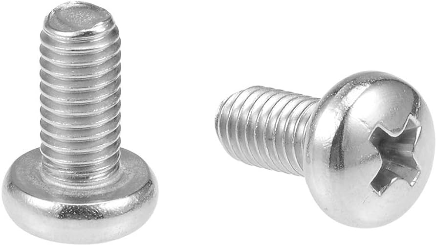

## Top
# 🎉 SYLVESTER - Multi-Output RAIL DIN Board with Fused Terminal Blocks v1.0.0
### ◀️ [Back](/)

<!--📷-->

## Table of Contents

- 🌐 [Overview](#overview)
- ⭐ [Features](#features)
- 🤔 [Things you need to know](#things-you-need-to-know)
- ⚙️ [Installation](#installation)
- 🖥️ [Compatible Processor Boards](#compatible-processor-boards)
- ❓ [FAQ](#faq)
- 📜 [Disclaimer](#disclaimer)
- 📝 [License](#license)

## Overview

SYLVESTER is a specialized RAIL DIN board that solves the common problem of distributing AC power for DIY electronic projects. Measuring 76mm x 86mm, it features two screw holes, making installation convenient. The board comprises 2 input screw terminal blocks with blow glass fuses and 6 output screw terminal blocks, each assigned with a blow glass fuse for individual protection.

This board streamlines the distribution of AC power for multiple devices, eliminating the need for multiple circuit breakers or terminal blocks. Each output terminal block ensures safe power distribution with individual fused protection.

### Features
- RAIL DIN board designed for distributing AC power to multiple devices.
- Features 2 input screw terminal blocks with blow glass fuses for protection.
- Includes 6 output screw terminal blocks, each with individual blow glass fuses.
- Streamlines power distribution without the need for multiple circuit breakers or terminal blocks.
- Provides safe and organized power distribution for DIY electronic projects.

[🔝 Top](#top)

## Things you need to know

NA

[🔝 Top](#top)

## Installation

Things and diagram you will need, for wiring and to implement RAIL DIN configurations:

| How to Wire Diagram | Sample Wiring | Slotted Metal Rail DIN  | Screws M3 D=3mm, L=6mm   | Mounting Brackets (25mm center to center) |
|--------------------|--------------------------------------------|-------------------------------------------------------------------------------------------------------|--------------------------------------------------------------------------------------------------------------------------------------------------|---------------|
|  |  |  |  |  |
|||[🛍️ BUYHERE](#)|[🛍️ BUYHERE](#)|[🛍️ BUYHERE](#)|

  
[🔝 Top](#top)

## Compatible Processor Boards

| Board              | Link                                       | Image                                                                                                 | Description                                                                                                                                      | GPIO Output Pins     |
|--------------------|--------------------------------------------|-------------------------------------------------------------------------------------------------------|--------------------------------------------------------------------------------------------------------------------------------------------------|---------------|
| NA | NA | NA | NA | NA |

[🔝 Top](#top)

## FAQ

N/A

[🔝 Top](#top)

## Disclaimer

NA

[🔝 Top](#top)

## License

NA

[🔝 Top](#top)

<!--

i am creating an amazon listing for below special purpose printed circuit board, this board primary purpose is to 
act as a mounting board for ESP8266 nodeMCU V3,  

create an amazon listing descriptions in HTML format with complete cool emoji, should be easy to read and use simple terms 

and create also a bulleted features

extract this from below summary

the format is 

TITLE
DESCRIPTIONS 
FEATURES

FOGHORN BOARD
MOUNTING dual 15 pins female headers FOR ESP8266 NODEMCU V3
15 pins male and female mapped to ESP module pins for ease of use using jumper wires connections to projects
analog pin header for A0 
5 pins terminal screw block mapped directly to ground, gpio 4,5,12 and 14 microcontroller
dc supply options choose between 5vdc directly to VIN or 12vdc power source and use built in 
dc regulator to convert 12vdc to produce 5vdc and send to VIN, to use this option you need to short the XX jumper pins of JP1
there are also two pin male/female headers for allowing user to connect using jumper wires, 

the board layout  76 mm width by 86 mm high is designed to be RAIL DIN compatible, with screw hole on the sides of 25mm center to center spacing 

DHT header ready, you can insert DHT11 or DHT22 in the 5 pins female headers, 

all headers pins are 1.24mm standard spacing

-->
