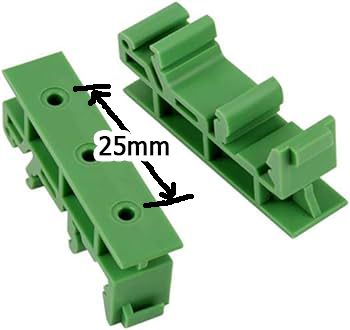

## Top
# 🎉 SYLVESTER - Multi-Output RAIL DIN Board with Fused Terminal Blocks v1.0.0
### ◀️ [Back](/)

<!--📷-->

## Table of Contents

- 🌐 [Overview](#overview)
- ⭐ [Features](#features)
- 🤔 [Things you need to know](#things-you-need-to-know)
- ⚙️ [Installation](#installation)
- 🖥️ [Compatible Processor Boards](#compatible-processor-boards)
- ❓ [FAQ](#faq)
- 📜 [Disclaimer](#disclaimer)
- 📝 [Demo](#demo)

## Overview

SYLVESTER is a specialized RAIL DIN board that solves the common problem of distributing AC power for DIY electronic projects. Measuring 76mm x 86mm, it features two screw holes, making installation convenient. The board comprises 2 input screw terminal blocks with blow glass fuses and 6 output screw terminal blocks, each assigned with a blow glass fuse for individual protection.

This board streamlines the distribution of AC power for multiple devices, eliminating the need for multiple circuit breakers or terminal blocks. Each output terminal block ensures safe power distribution with individual fused protection.

### Features
- RAIL DIN board designed for distributing AC power to multiple devices.
- Features 2 input screw terminal blocks with blow glass fuses for protection.
- Includes 6 output screw terminal blocks, each with individual blow glass fuses.
- Streamlines power distribution without the need for multiple circuit breakers or terminal blocks.
- Provides safe and organized power distribution for DIY electronic projects.

[🔝 Top](#top)

## Things you need to know

### SYLVESTER - Multi-Output RAIL DIN Board with Fused Terminal Blocks
- **AC Power Distribution:** Utilize the board for streamlined AC power distribution to multiple devices for DIY projects.
- **Fused Protection:** Each output screw terminal block has individual blow glass fuses for safe power distribution.
- **Installation:** The board comes with two screw holes for convenient and easy installation on the RAIL DIN system.
- **Eliminating Circuit Breakers:** This board replaces the need for multiple circuit breakers or terminal blocks in your setup.
- **Safe Power Distribution:** Provides organized and safe power distribution, ensuring the protection of connected devices.

[🔝 Top](#top)

## Installation

Things and diagram you will need, for wiring and to implement RAIL DIN configurations:

| How to Wire Diagram | Sample Wiring | Slotted Metal Rail DIN  | Screws M3 D=3mm, L=6mm   | Mounting Brackets (25mm center to center) |
|--------------------|--------------------------------------------|-------------------------------------------------------------------------------------------------------|--------------------------------------------------------------------------------------------------------------------------------------------------|---------------|
|  |  |  |  |  |
|||[🛍️ BUYHERE](#)|[🛍️ BUYHERE](#)|[🛍️ BUYHERE](#)|

  
[🔝 Top](#top)

## Compatible Processor Boards

| Board              | Link                                       | Image                                                                                                 | Description                                                                                                                                      | GPIO Output Pins     |
|--------------------|--------------------------------------------|-------------------------------------------------------------------------------------------------------|--------------------------------------------------------------------------------------------------------------------------------------------------|---------------|
| NA | NA | NA | NA | NA |

[🔝 Top](#top)

## FAQ

N/A

[🔝 Top](#top)

## Disclaimer

NA

[🔝 Top](#top)

## Demo

[🔝 Top](#top)
